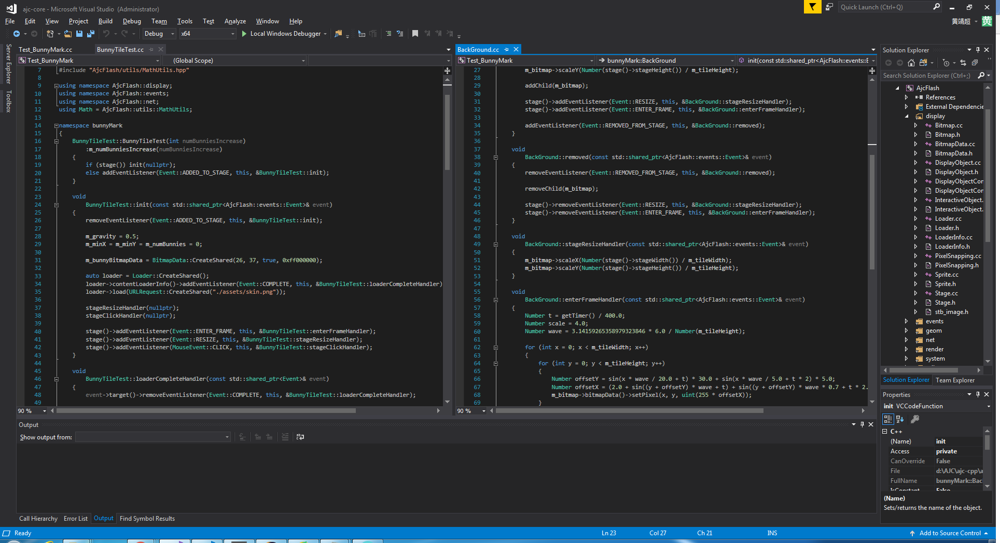
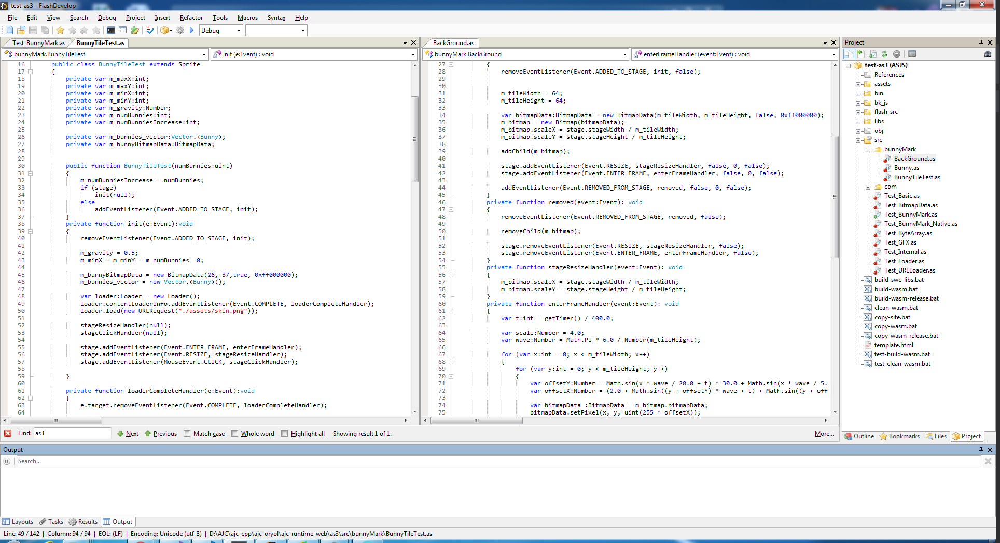
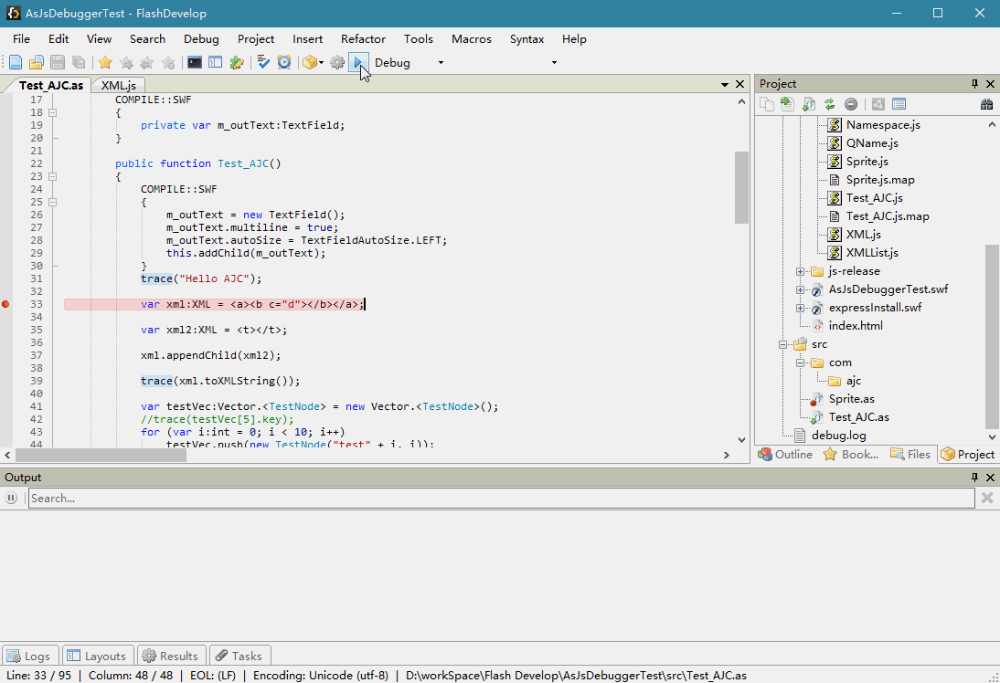

# AJC-Flash-WebAssembly-Examples
AJC stands for AnyScripts JavaScript C++. 
(This project has been suspended on May 2018)

## What and Why?
As [Adobe has announced](http://blogs.adobe.com/conversations/2017/07/adobe-flash-update.html) it will stop distributing and updating Flash Player at the end of 2020, we believe Flash API is very powerful for delivering rich media contents, and it may serve much more than just web applications. So we decided to build a c++ version of Flash API and using WebAssembly for targeting to web platforms, which contains most of the [Flash API](https://help.adobe.com/en_US/FlashPlatform/reference/actionscript/3/).

The reason of doing this is because we love flash and also we wanna provide an efficient-fast-safe c++ version of Flash API for not only As3 language, but also for Java Script and Type Script ( we may consider JAVA and C# in the future).So they are able to natively run on web platform just like what flash player did.
As we use c++ to develop the entire API, it could be also used as a high-level rich media c++ API for cross-platform developing, such as Windows, OSX, IOS, Android, etc.

## How?
For supporting scripting languages, using a stable transpiler to compile them to JavaScript, and use compiled Java Script to interact with compiled WebAssembly.

For example, our As3 approach is using a customized [FalconJX Compiler](https://cwiki.apache.org/confluence/display/FLEX/Getting+Started+with+the+Falcon+and+FalconJX+Compilers) to compile all As3 source codes into Java Script while using an external-library(similar with .d.ts in Type Script or .h with no definitions in c++ ) to provide declarations for those class/function that implemented in c++ side.(this step is very similar with compiling type script to Java Script) 
Then, we load compiled wasm into web browser to provide Flash API for runtime environment, and simulating As3 inheritance and any other As3 intrinsic language features after initializing wasm.
Therefore, currently it runs exactly the same as original As3 with flash player.

## Present
After few months hard working, we have:
* A sdk suit for building AS3-JavaScript.
* A customized Flash-Develop code IDE to develop As3 projects for targeting both flash player and java script, including debugger using [Java Script source maps](https://developer.mozilla.org/en-US/docs/Tools/Debugger/How_to/Use_a_source_map) and interacting with chrome  remote interface. So you may debug your Java Script files that compiled from original As3 files as exactly the same as you compile them to target original flash player.
* A customized embind for emscripten.
* An initial state of Flash API coding in c++, currently supports display list, event flow, efficient gpu 2d renderer, basic data structures, etc.

## Demo
AJC-bin contains serveral demos below:
### [cpp-wasm](https://jasonhuang3d.github.io/WebAssembly-Examples/AJC-bin/cpp-wasm/)
In this folder, we wrote the As3 source codes the previous demo used into c++ side, because we have the same flash API in c++ side, so the bunnyMark c++ source code looks almost the same as As3 one. Even with coding styles:)
Basically we are using only wasm, but used same flash API as previous demo used. You may change the number of bunnies by changing Test_BunnyMark_Native.js line:39.

### [as3-js-wasm](https://jasonhuang3d.github.io/WebAssembly-Examples/AJC-bin/as-js-wasm/)
In this folder, we compiled As3 source codes to corresponding Java Scripts, then using compiled Java Scripts to use wasm that contains flash api.
Basically we are using As3 and Flash API with wasm. You may change the number of bunnies by source codes provided in AJC-code, or just modify the value inside of Test_BunnyMark.js line:56.

### win-vc140
In this folder, we used the same source codes with previous cpp-wasm demo to compile to windows native platform with -OX optimized level. You may change the number of bunnies by passing -numBunnies cmd arg.

## Source
AJC-code contains the full As3 source codes in order to build the bunnyMark demo. 
in order to build, you may need [Apache Ant](https://ant.apache.org/bindownload.cgi). Simply unzip the ajc-asjs-sdk.zip, and call ant in the root of the As3 source folder, will use same As3 source codes to build to both original flash player and java script that interacting with wasm.

## Debug
I implemented a chrome-remote-debug protocol in Flash-Develop IDE, now debugging compiled JS with AS3 source code in Flash-Develop IDE is not a problem anymore.

## Performance 
cpp-wasm is almost as fast as native win-vc140. However, as3-js-wasm is about 1.5 times slower than them, due to the cost of a huge number of times that interacting js with cpp side, the cost of writing and reading shared-heap-array is a bit overhead.
We will be keep optimizing embind. if you have any suggestions, please let me know.

## What next?
We will be mainly focusing on finishing our c++ Flash API as fast as we can, we all knew this is not an easy task to achieve. But we will never give up, cause we are someone just like you who loves Flash.
We would truly appreciate any part of help from you. 
If you are interested in this project and willing to join us, please let me know. 

